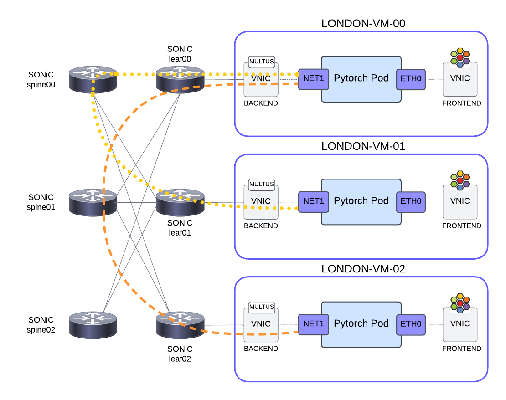
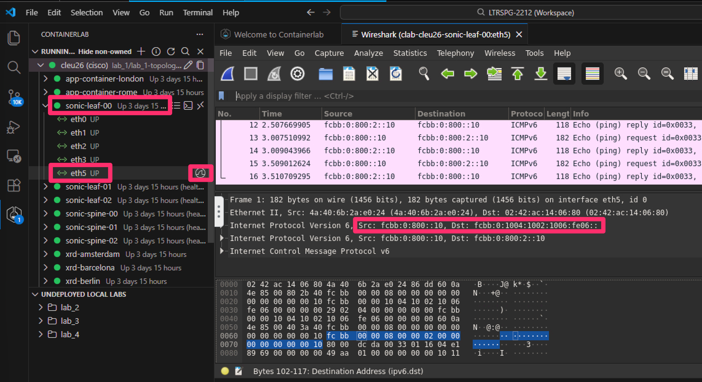
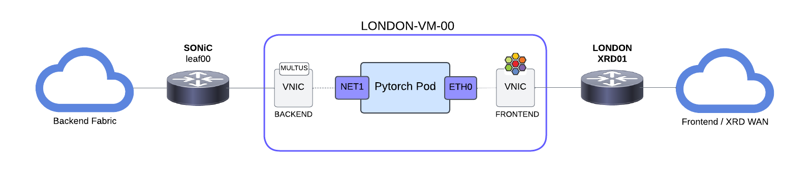
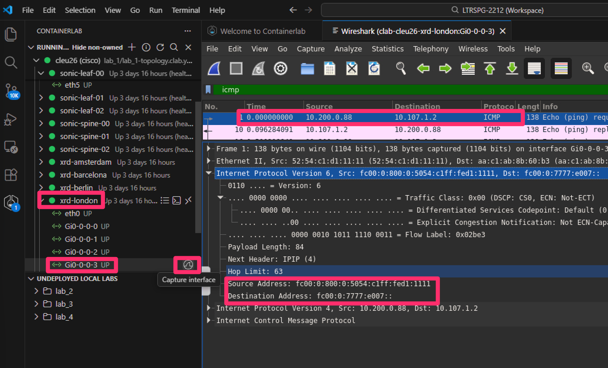

# Lab 5: SRv6 for Intelligent Load Balancing of AI Workloads [20 Min]

### Description
In recent months a few Hyperscalers have expressed interest in running SRv6 over their AI training fabrics. The idea would be to offer their customers the ability to do intelligent and deterministic load balancing of large, long-lived flows, by pinning them to specific paths thru the fabric. The goal is to perform SRv6 encapsulation right at the host stack or RDMA NIC: *`host-based SRv6!`*

In Lab 5 we will explore this use case with our SONiC backend fabric and the attached *`london VMs`* simulating an AI Training infrastructure. 


## Contents
- [Lab 5: SRv6 for Intelligent Load Balancing of AI Workloads \[20 Min\]](#lab-5-srv6-for-intelligent-load-balancing-of-ai-workloads-20-min)
    - [Description](#description)
  - [Contents](#contents)
  - [Lab Objectives](#lab-objectives)
  - [Host-Based SRv6 for Intelligent Fabric Load Balancing](#host-based-srv6-for-intelligent-fabric-load-balancing)
    - [SRv6 Linux Kernel Routes](#srv6-linux-kernel-routes)
  - [SRv6 for AI Backend Workloads](#srv6-for-ai-backend-workloads)
    - [Jalapeno and Modeling Networks as Graphs](#jalapeno-and-modeling-networks-as-graphs)
    - [AI/ML Workloads and Kubernetes](#aiml-workloads-and-kubernetes)
    - [PyTorch Distributed Training](#pytorch-distributed-training)
    - [*SRv6 PyTorch Plugin*](#srv6-pytorch-plugin)
    - [Deploying the SRv6 PyTorch Pods](#deploying-the-srv6-pytorch-pods)
    - [Manually test the SRv6 PyTorch Pods' routes](#manually-test-the-srv6-pytorch-pods-routes)
    - [Frontend Connectivity](#frontend-connectivity)
  - [End of lab 5](#end-of-lab-5)


## Lab Objectives
The student should have achieved the following objectives upon completion of Lab 5:

* Understand the SRv6 Fabric Load Balancing use case
* Familiarity with the SRv6 stack available in Linux
* Understanding of SONiC's SRv6 uSID shift-and-forward capabilities
* Familiarity with the idea of exposing SRv6 steering services to AI training frameworks and schedulers
* Bonus if time allows: familiarity with the open-source Jalapeno project, its API, and UI

## Host-Based SRv6 for Intelligent Fabric Load Balancing

At the 2025 OCP Global Summit, Changrong Wu and Abhishek Dosi from Microsoft explained how they build Source Routed AI Backend Networks with SRv6:

https://www.segment-routing.net/conferences/2025-10-16-ocp-summit25-microsoft-srv6-ai-backend/

The key problem to solve:

 - ECMP of large, long-lived flows can result in path collision or hotspots in the fabric. 
 - With AI training this can lead to delays or even job failures. 
 - Given the cost of running large GPU pools, delay or failure becomes very costly.

The solution: *coordination of all senders source routing their traffic over disjoint paths through the fabric.*

Cisco doesn't currently have a controller product for host-based SRv6 and the Hyperscalers build their own SDN control infrastructure. So to simulate this capability in the lab we've built a *`demo SRv6 PyTorch plugin`* which programs SRv6 routes in the Linux kernel, and which leverages the open-source *`project Jalapeno`* as its backend data repository.

 - SRv6 PyTorch plugin: https://github.com/segmentrouting/srv6-pytorch-plugin

 - PyTorch Homepage: https://pytorch.org/

 - SRv6 Linux Kernel Implementation: https://segment-routing.org/

 - Project Jalapeno Homepage: https://github.com/cisco-open/jalapeno


### SRv6 Linux Kernel Routes

Before we get into PyTorch and AI Backend fabrics, let's manually add a Linux route with SRv6 encapsulation:

1. Return to your ssh session on **london-vm-00** and add a Linux SRv6 route to **london-vm-02** that will take the path **leaf00** -> **spine01** -> **leaf02**:

   ```
   sudo ip -6 route add fcbb:0:0800:2::/64 encap seg6 mode encap segs fcbb:0:1004:1001:1006:fe06:: dev ens5
   ```

2. Display the Linux route on **london-vm-00**:
   ```
   ip -6 route show fcbb:0:0800:2::/64
   ```

   Expected output:
   ```
   $ ip -6 route show fcbb:0:0800:2::/64
   fcbb:0:800:2::/64  encap seg6 mode encap segs 1 [ fcbb:0:1004:1001:1006:fe06:: ] dev ens5 metric 1024 pref medium
   ```

   - The SRv6 uSID combination in the above will route traffic from **london-vm-00** to **london-vm-02** via **leaf00**, **spine01**, and **leaf02**.
     
   - The packet that egresses from london-vm-00 will have an outer IPv6 destination header of *`fcbb:1004:1001:1006:fe06::`* and an inner packet header destination of *`fcbb:0:0800:2::2/128`*. 
   
   - The uSID shift-and-forward at **leaf00** and **spine01** will result in an ipv6 destination address of *`fcbb:1006:fe06::`* when the packet arrives at **leaf02**. 
   
   - **leaf02** recognizes itself and its local uDT6 entry *`fe06`* in the destination address and will proceed to pop the outer IPv6 header and do a lookup on the inner destination address *`fcbb:0:0800:2::/64`*. 
   
   - **leaf02** will then forward the traffic to **london-vm-02**

   

3. Using the visual code containerlab extension, connect to SONiC **leaf02**, invoke FRR vtysh and 'show run' to see the SRv6 local SID entries, including the uDT6 entry for decapsulating and forwarding traffic to **london-vm-02**:
   
   **leaf02**
   ```
   vtysh
   show run
   ```

> [!NOTE]
> To inspect specific parts of the configuration, you can also run the following command from the shell (outside of vtysh mode):
>
> vtysh -c "show running-config" | grep -A 10 "segment-routing"
>
> This filters and displays the Segment Routing configuration along with the 10 lines that follow.
```
vtysh -c "show running-config" | grep -A 10 "segment-routing"
```

```diff
admin@leaf02:~$ sudo vtysh -c "show running-config" | grep -A 10 "segment-routing"
segment-routing
 srv6
  static-sids
   sid fc00:0:1006::/48 locator MAIN behavior uN
   sid fc00:0:1006:fe04::/64 locator MAIN behavior uDT4 vrf default
+   sid fc00:0:1006:fe06::/64 locator MAIN behavior uDT6 vrf default
  exit
  !
 exit
 !
 srv6
 ```

4. Optional: run a ping from **london-vm-00** to **london-vm-02** and capture the traffic with an Edgshark session on the interface connected to the **leaf00** bridge: 

    ```
    ping fcbb:0:800:2::2 -i .5
    ```


Or for a quick validation of the packet encap open a new terminal session to **topology-host** and run a tcpdump on the underlying connection between **london-vm-00** and **leaf00**:

   ```
   sudo tcpdump -ni london-vm-00-be
   ```

Expected output will be something like:

   ```diff
   cisco@topology-host:~$ sudo tcpdump -ni london-vm-00-be
   tcpdump: verbose output suppressed, use -v[v]... for full protocol decode
   listening on london-vm-00-be, link-type EN10MB (Ethernet), snapshot length 262144 bytes
   +23:18:42.196845 IP6 fcbb:0:800::2 > fcbb:0:1004:1001:1006:fe06::: RT6 (len=2, type=4, segleft=0, last-entry=0, tag=0, [0]fcbb:0:1004:1001:1006:fe06::) IP6 fcbb:0:800::2 > fcbb:0:800:2::2: ICMP6, echo request, id 28522, seq 136, length 64
   23:18:42.197926 IP6 fcbb:0:800:2::2 > fcbb:0:800::2: ICMP6, echo reply, id 28522, seq 136, length 64
   ```

> [!NOTE]
> We only specified an encapsulated route in the outbound direction, so the return traffic is not encapsulated

1. Delete the route as we don't want to confuse an SRv6 route on the **london-vm-00** with the SRv6 routes our K8s pods will be running later in the lab

    ```
    sudo ip -6 route del fcbb:0:0800:2::/64
    ```

## SRv6 for AI Backend Workloads

### Jalapeno and Modeling Networks as Graphs

Using the [Lab 5 scripts and data](./jalapeno/backend/) we pre-built a model of our SONiC fabric/SRv6 topology in Jalapeno's Arango Graph Database. This makes the fabric topology graph available to *`PyTorch`* (or other SDN applications) via Jalapeno's API. 

Use this link to open the [Jalapeno UI](http://198.18.128.101:30700) into a new tab/window. 

1. Select "Topology Viewer" 
2. Select "fabric graph" from the dropdown
3. Then you can click "select a layout" and change the layout to show the topology as a CLOS or other options


After completing **Lab 5** feel free to checkout the [Lab 5 Bonus Section](./lab_5-bonus.md) that explores the Jalapeno GraphDB, API, UI, and other host-based SRv6 scenarios in more detail.

### AI/ML Workloads and Kubernetes

Its very common for operators to use Kubernetes to orchestrate ML workloads and have them communicate over dedicated backend networks. We have our Kubernetes cluster with the **London VMs**, which all happen to have a 2nd interface **ens5** plugged into our SRv6 enabled SONiC backend fabric.

### PyTorch Distributed Training

From https://pytorch.org/projects/pytorch/

*PyTorch is an open source machine learning framework that accelerates the path from research prototyping to production deployment. Built to offer maximum flexibility and speed...its Pythonic design and deep integration with native Python tools make it an accessible and powerful platform for building and training deep learning models at scale.*

**PyTorch Workflow:**
When you start a distributed training workload, PyTorch initializes a process group. It uses a backend like [NCCL](https://developer.nvidia.com/nccl) or [Gloo](https://github.com/pytorch/gloo) for communication between nodes. Each node gets a rank and knows about other nodes through the process group

### *SRv6 PyTorch Plugin*

We built an SRv6 Plugin for Pytorch!

In a few moments we'll launch a PyTorch test in our London K8s cluster. Immediately after the containers deploy PyTorch will initialize. Then before NCCL/Gloo starts communicating, the SRv6 PyTorch plugin will:

  - Get the list of nodes from the distributed workload setup
  - Query the Jalapeno API for a shortest-path (lowest *`load`* metric) for each *source/destination* pair
  - The API returns an SRv6 uSID encapsulation instruction for each *source/destination* pair that will pin traffic to a specific path in the fabric
  - The *`srv6 plugin`* then programs Linux SRv6 routes on the *container*, similar to the route we manually programmed earlier on **london-vm-00**. 
  - The distributed workload's traffic is SRv6 encapsulated as it egresses the source *container*

The effect is the workload's traffic is intelligently load balanced across the fabric and no longer subject to the potential imbalances and congestion associated with ECMP

> [!Note]
> If we had GPUs and RDMA NICs we would work to extend the plugin to program route + SRv6 encap entries on the RDMA NIC itself


Here's a summary of the workflow:

```
[PyTorch Training Script]
        ↓
[Initialize Distributed Training]
        ↓
[PyTorch calls NCCL or Gloo backend]
        ↓
[SRv6 Plugin intercepts, calls Jalapeno API]
        ↓
[SRv6 Plugin programs ip routes with SRv6 encapsulation instructions from Jalapeno]
        ↓
[NCCL/Gloo uses routes for communication]
        ↓
[Training continues normally]
```

### Deploying the SRv6 PyTorch Pods

For the final step in our lab we're going to deploy a set of K8s pods (*`PyTorch nodes`*) pre-loaded with our SRv6-PyTorch plugin, and test node-to-node SRv6 communication. 

The plugin includes a simple demo that uses a *`gloo`* backend because *`gloo`* doesn't require GPUs and still provides distributed training functionality. 

Upon deployment the nodes will perform all the PyTorch ML setup steps, including SRv6 plugin functionality, but will not perform actual ML training...in a future version of this lab we'll try and integrate a small dataset to train on.

1. Return to your ssh session to the **london-vm-00** Kubernetes control plane node and cd into the lab_5/srv6-pytorch/ directory

   ```
   cd ~/LTRSPG-2212/lab_5/srv6-pytorch/
   ```

2. Use the *kubectl apply* command to deploy the *srv6-plugin* test pods:

   ```
   kubectl apply -f srv6-pytorch-test.yaml
   ```

   Expected output:
   ```
   $ kubectl apply -f srv6-pytorch-test.yaml 
   configmap/pytorch-distributed-config created
   pod/srv6-pytorch-0 created
   pod/srv6-pytorch-1 created
   pod/srv6-pytorch-2 created
   service/srv6-pytorch created
   ```

   As the pods deploy and the PyTorch job initializes, the *`srv6-plugin`* takes action. It should create SRv6 routes for each *`pod`* to each other *`pod`* participating in the workload.

   - *`srv6-pytorch-0`* --> *`srv6-pytorch-1`* and *`srv6-pytorch-2`*
   - *`srv6-pytorch-1`* --> *`srv6-pytorch-0`* and *`srv6-pytorch-2`*
   - *`srv6-pytorch-2`* --> *`srv6-pytorch-0`* and *`srv6-pytorch-1`*

   The "job" completes with some pings from each host to each host.

3. Use *kubectl logs* command to see the plugin's log output from the *srv6-pytorch* pods. May take 3-4 minutes for the job to complete:

   ```
   kubectl logs srv6-pytorch-0
   ```

   Look for successful pings and "Adding route" entries that look something like this:
   ```
   Adding route to fcbb:0:800:1::/64 with encap: {'type': 'seg6', 'mode': 'encap.red', 'segs': ['fcbb:0:1004:1001:1005:fe06::']} to table 254
   Adding route to fcbb:0:800:2::/64 with encap: {'type': 'seg6', 'mode': 'encap.red', 'segs': ['fcbb:0:1004:1002:1006:fe06::']} to table 254
   ```
> [!Note]
> The "Adding route" entries should show uSID *`encap.red`* entries with some amount of disjointness. In the example the first route will traverse **leaf00** -> **spine01** -> **leaf01**, the second entry will traverse **leaf00** -> **spine02** -> **leaf02**. 
>
> With these route + SRv6 encapsulation entries in place the PyTorch training job's traffic to its peers would be evenly load balanced across the traffic without any chance of collision or fabric congestion!



   Optional: display the logs from the other two *`srv6-pytorch`* pods.  We should see very similar log output
   ```
   kubectl logs srv6-pytorch-1
   kubectl logs srv6-pytorch-2
   ```

We didn't review the *`srv6-pytorch`* yaml in detail, but if you take a look at the first few lines of the [pod spec](./srv6-pytorch/srv6-pytorch-test.yaml) you'll see that in addition to the default *`Cilium-provided`* frontend interface, the pod has been configured to have a backend, **Multus** provided interface. And we've configured the pods to join *`VRF carrots!`*:

   ```diff
   kind: Pod
   metadata:
   name: srv6-pytorch-0
   labels:
      app: srv6-pytorch
      role: master
   +   vrf: carrots
   annotations:
      k8s.v1.cni.cncf.io/networks: |
         [{
   +      "name": "backend-network",
   +      "ips": ["fcbb:0:0800:0::10/64"]
         }]
   ```

### Manually test the SRv6 PyTorch Pods' routes

1. Exec into one of the *`srv6-pytorch`* pods and manually check the Linux ipv6 routes
   
    ```
    kubectl exec -it srv6-pytorch-0 -- bash
    ```

    List the pod's relevant ipv6 routes
    ```
    ip -6 route | grep fcbb:0:800
    ```

    We expect to see a few route entries, two of which have SRv6 encapsulation instructions. Example output:
    ```diff
    root@srv6-pytorch-0:/app# ip -6 route | grep fcbb:0:800
    fcbb:0:800::/64 dev net1 proto kernel metric 256 pref medium
    +fcbb:0:800:1::/64  encap seg6 mode encap segs 1 [ fcbb:0:1004:1002:1005:fe06:: ] dev net1 proto static metric 1024 pref medium
    +fcbb:0:800:2::/64  encap seg6 mode encap segs 1 [ fcbb:0:1004:1000:1006:fe06:: ] dev net1 proto static metric 1024 pref medium
    fcbb:0:800::/48 via fcbb:0:800::1 dev net1 metric 1024 pref medium
    fcbb::/32 via fcbb:0:800::1 dev net1 metric 1024 pref medium
    ```

2. Run a ping from **srv6-pytorch-0** to **srv6-pytorch-2**:
    ```
    ping fcbb:0:800:2::10 -i .5
    ```

3. While the ping is running start an Edgeshark capture on **leaf00's** Ethernet16 interface - *`Note: it appears as eth5 in Visual Code`*. The capture should show the pings as SRv6 encapsulated packets with the uSID stack programmed by the SRv6 PyTorch plugin. 





Feel free to Edgeshark capture other interfaces in the fabric. 

- If the 2nd uSID in the route entry is "1000" capture **spine00** eth1
- If the 2nd uSID in the route entry is "1001" capture **spine01** eth1
- If the 2nd uSID in the route entry is "1002" capture **spine02** eth1


### Frontend Connectivity

The **SRv6 PyTorch pods** are connected to both the backend SONiC fabric and the frontend XRd network. As we saw in Lab 3 the frontend connections are using Cilium. And our SRv6-PyTorch pod definition included a spec to attach them to *`vrf carrots`* on the frontend.




1. Run a *frontend* ping from the *`srv6-pytorch-0`* worker pod to the remote **Rome** container in *VRF carrots*
   
   If your terminal session is still *exec'd* into the pod run the ping directly
   ```
   ping 10.107.1.2 -i .5
   ```

   If you had exited the pod and are at the **london-vm-00** shell you can run the ping from there:
   ```
   kubectl exec -it srv6-pytorch-0 -- ping 10.107.1.2 -i .5
   ```

2. While the ping is running start an Edgeshark capture on **london-xrd01** Gi0-0-0-3. The capture should show the pings as SRv6 encapsulated packets with the uSID stack programmed by the SRv6 PyTorch plugin. 




**Congratulations, you have reached the end of Cisco Live Lab LTRSPG-2212, hurray!!**

## End of lab 5
If you would like to explore host-based SRv6 some more feel free to try [Lab 5 Bonus Section](https://github.com/cisco-asp-web/LTRSPG-2212/blob/main/lab_5/lab_5-bonus.md)


